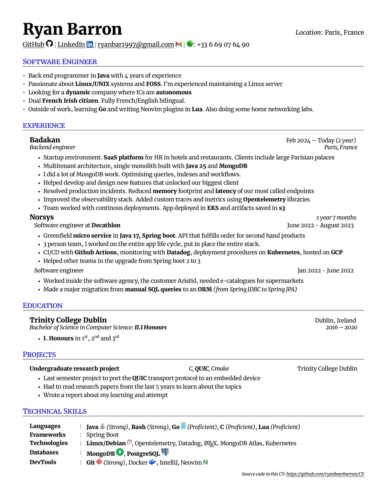
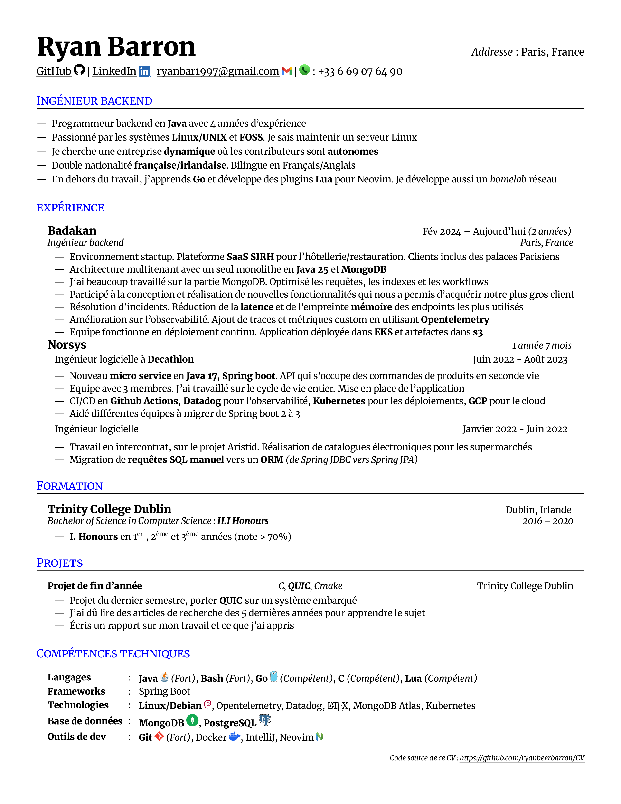

[![LinkedIn][linkedin-shield]][linkedin-url]

# My CV in Latex

Source repository to edit and build my CV in both french and english

## Preview

English version

Version française

## Acknowledgments

- Based on [sb2nov/resume](https://github.com/sb2nov/resume/)
- Based on [punchamoorthee/Rezume](https://github.com/punchamoorthee/Rezume/)

[linkedin-shield]: https://img.shields.io/badge/-LinkedIn-black.svg?style=for-the-badge&logo=linkedin&colorB=555
[linkedin-url]: https://www.linkedin.com/in/ryan-b-b15a12153/?locale=en_US
